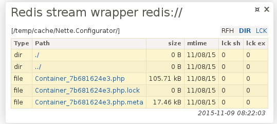

# redis-php-stream-wrapper

[](https://travis-ci.org/sallyx/redis-php-stream-wrapper)
[](https://packagist.org/packages/sallyx/redis-php-stream-wrapper)
[](https://packagist.org/packages/sallyx/redis-php-stream-wrapper)

This package allows you to register redis server as [php stream wrapper](http://php.net/manual/en/intro.stream.php),
so you will be able to use redis as as stream resource, i.e. 'redis://foo.txt'

## Install

### 1. Install phpredis/phpredis

See .

### 2. Install packages by composer

```sh
$ composer require sallyx/redis-php-stream-wrapper
```

## Setup

### All together

```php
use Sallyx\StreamWrappers\Redis\ConnectorConfig;
use Sallyx\StreamWrappers\Redis\PathTranslator;
use Sallyx\StreamWrappers\Redis\Connector;
use Sallyx\StreamWrappers\Redis\FileSystem;
use Sallyx\StreamWrappers\Wrapper;

$config = new ConectorConfig;
$translator = new PathTranslator('www.sallyx.org');
$connector = new Connector($config, $translator);
$fs = new FileSystem($connector);
Wrapper::register($fs);
```

### Step by step

#### 1. Create configuration

```php
use Sallyx\StreamWrappers\Redis\ConnectorConfig;

$config = new ConnectorConfig( // all parameters are optional
    '127.0.0.1',
    $port = 6379,
    $timeout = 0,
    $persistent_id = NULL,
    $retry_interval = NULL
);
$config = new connectorConfit('/tmp/redis.sock'); // socket connection
```

#### 2. Create path translator
```php
use Sallyx\StreamWrappers\Redis\PathTranslator;
$translator = new PathTranslator($prefix = 'www.example.org');
```
Prefix is used for keys in redis server. For example file 'redis://foo.txt' will be saved in redis under key 'www.example.org://foo.txt'.

#### 3. Create connector

```php
use Sallyx\StreamWrappers\Redis\Connector;
$connector = new Connector($config, $translator);
```

#### 4. Create redis file system

```php
use Sallyx\StreamWrappers\Redis\FileSystem;
$fs = new FileSystem($connector);
```

#### 5. Register as stream wrapper

```php
use Sallyx\StreamWrappers\Wrapper;
Wrapper::register($fs,'redis'); // 'redis' is a scheme  name of the wrapper ('redis:// ...')
```

#### 6. Profit

```php
mkdir('redis://foo');
file_put_contents('redis://foo/bar.txt', 'hello world');
echo file_get_contents('redis://foo/bar.txt');
...
```

## Using with Nette

If you do not know Nette, have a look at [www.nette.org](https://www.nette.org) or skip this block :)

First put [setup](/README.md#user-content-setup/) into app/bootstrap.php or anywhere before you want to
use redis stream wrapper. Then you can use redis for example for temp directory:

```php
use Sallyx\StreamWrappers\Redis\Connector;
use Sallyx\StreamWrappers\Redis\ConnectorConfig;
use Sallyx\StreamWrappers\Redis\PathTranslator;
use Sallyx\StreamWrappers\Redis\FileSystem;
use Sallyx\StreamWrappers\Wrapper;

$cc = new ConnectorConfig();
$con = new Connector($cc, new PathTranslator('www.example.org'));
Wrapper::register(new FileSystem($co));
//...
$configurator->enableDebugger('redis://log');
$configurator->setTempDirectory('redis://temp');
//...
```
Optionally, you can use StreamWrappersExtension in app/config/config.local.neon, which show diagnostic panel in debugger bar.

```
extension:
        streamWrappers: Sallyx\Bridges\StreamWrappers\Nette\DI\StreamWrappersExtension
```
Now you could see your redis filesystem in the panel:



## Known issues

If your PHP script ends unexpectedly, all locked files stay locked forever.
You can unlock them in redis by this command:

```
HMSET www.example.org://foo/bar.txt lock_ex 0 lock_sh 0
```

Access rights are not supported (yet?).
Functions like chmod(), chgrp(), chown() return always false.
